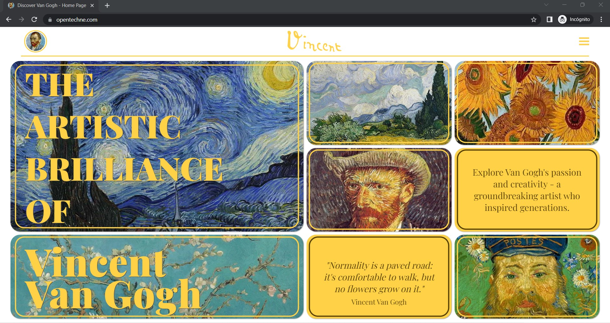

<h1 align="center">Discover Vincent Van Gogh 💙🎨</h1>

<h2 align="center">This is Van Gogh's World: A Journey Through Art and Emotion.</h2>

Embark on a journey through the colorful and emotional world of Van Gogh's art. Explore his life story, his techniques, and the inspiration behind his masterpieces. Discover the passion, the pain, and the creativity behind his art.

This project has been created as part of my web design course, using the tools I've learned: HTML, CSS, and Javascript. The main objective of this page is to pay tribute to an exceptional artist and his legacy, as well as to arouse people's curiosity to learn more about his life and work. I hope you enjoy this page and that it awakens your curiosity to learn more about the life and work of this great artist. On my website, visitors will be able to access information about Van Gogh's beginnings in the art world, as well as discover the reasons that led him to devote his life to painting. They will also gain insights into the challenges and loneliness that he experienced throughout his life, as well as the interesting facts that surrounded him. The most significant events in his life, from his early days to the end of his days, will be highlighted for viewers to explore.

<h2 align="center">

Design process: Figma🖥️

 </h3>

[screen-capture (10).webm](https://user-images.githubusercontent.com/125751323/235307882-a0d2f756-ba5b-47ea-8ce2-c568e8d77e00.webm)

<h3 align="center">

🌟Thank you for visiting my final web design project!🌟

 </h3>

## Used Technologies  🟠 🔵 🟡

:bangbang: Additional Information: :bangbang:

> It has been programmed for entertainment purposes.

> It has been made specifically to practice and improve my skills.

<h3 align="center">📫 Connect with me: </h3>

<h3 align="center">🎨 Check out my work: </h3>

